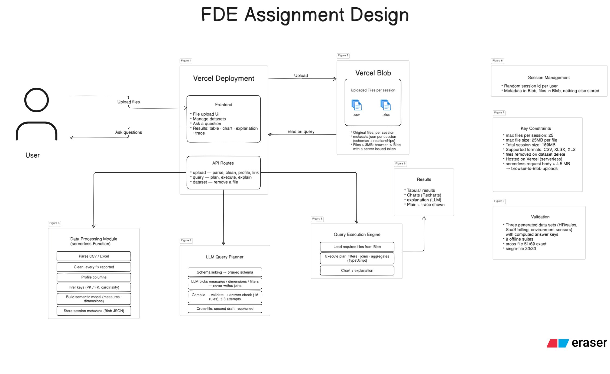

<h1 align="center">DataLens</h1>

<p align="center">Ask plain-English questions across uploaded CSV / Excel files. The model plans the query; a deterministic engine computes the answer, with a chart and a full trace.</p>

<p align="center">
  
  
  
  
  
  
  
  
  <a href="LICENSE"></a>
</p>

## Architecture

<p align="center"></p>

## Run locally

Needs Node.js 20+ and git.

```bash
git clone https://github.com/SubodhSenpai/Datalens.git
cd Datalens
npm ci
cp .env.example .env          # PowerShell: Copy-Item .env.example .env
# put ONE model key in .env:  OPENROUTER_API_KEY=sk-or-...   or   GEMINI_API_KEY=AIza...
npm run dev                   # http://localhost:3000
```

Try it: upload the four files in `test-data/validation-v2/` and ask *Total invoiced amount by industry*.

| Variable | When | Notes |
|---|---|---|
| `OPENROUTER_API_KEY` | one key required | https://openrouter.ai/keys — free open-source models only; `…2`, `…3` rotate |
| `GEMINI_API_KEY` | one key required | https://aistudio.google.com/apikey |
| `BLOB_READ_WRITE_TOKEN` | hosted only | Vercel Blob token |
| `NEXT_PUBLIC_BLOB_CLIENT_UPLOADS` | hosted only | `1` — browser uploads straight to Blob (serverless request cap ≈ 4.5 MB) |
| `CRON_SECRET` | hosted only | any long random string — authorises the daily cleanup cron |
| `NEXT_PUBLIC_SITE_URL` | hosted only | public URL for canonical links, sitemap and Open Graph (defaults to the Vercel URL) |

Optional: `LLM_PROVIDER`, `OPENROUTER_MODEL`, `GEMINI_MODEL`, `PLAN_CONSENSUS`, `SESSION_TTL_HOURS` — see `.env.example`.

## Validation

Three generated data sets, fixed seeds, every expected answer computed by the generator (`scripts/gen-*.ts`, keys in `test-data/*/TEST_QUESTIONS*.md`). Graded strictly: the value must match the key.

| Set | Traps built in | Single-file | Cross-file (exact) |
|---|---|---|---|
| v1 HR & sales — 12 files | padded/BOM headers, `9.5 lakh`, semicolon CSV, TOTAL row | 11 / 11 | 13 / 15 |
| v2 SaaS billing — 4 files, 6 tables | duplicate customer, two `amount` columns, title rows, DD/MM dates | 11 / 11 | 18 / 21 |
| v3 Environmental sensors — 4 files, 32k readings | `-999` codes, Suspect flags, °F/°C mix, limits in another sheet | 11 / 11 | 20 / 24 |
| **Total** | | **33 / 33** | **51 / 60 = 85 %** (95 % counting defensible readings) |

Ambiguity / guardrail tier (off-topic, mutation requests, no data for the period, mean-vs-median): 9 / 12. Charts on 35 of 45 cross-file results; the rest are lists or single values. Remaining misses: model consistency on the weakest free tier, provider timeouts, and two shapes not built (date bucket matched to period labels in another file; binned histograms).

## Techniques

All code is original. Where a row cites a reference, the *Basis* column states the one idea taken from it; everything else is own design.

| Stage | Technique | Basis |
|---|---|---|
| Loading | placeholder blanks, formatted numbers (`₹4,80,02,573.75`, `(500)`, `12%`, `9.5 lakh`), per-column day/month order, missing-value codes (`-999`), summary-row exclusion, spelling unification — each reported | own design |
| Relationships | PK/FK inference from uniqueness + value inclusion, cardinality classes, key-ness gate against low-cardinality columns | [1] a foreign key is a column whose values are contained in a unique column elsewhere (inclusion dependency); the test is implemented directly, not their algorithm |
| Semantic model | tables / measures / dimensions menu; long-format (`parameter`/`unit` → `value`) and QC-flag detection | [2] the model selects measures and dimensions from a semantic layer and never writes joins |
| Schema linking | lexical question → column matching (stem, plural, abbreviation), BFS join paths, schema pruned to linked tables + one hop | own design |
| Compilation | join path, post-join naming, column-vs-column filters, conditional measures, post-aggregation derives, multi-hop anti-joins | own design |
| Multi-fact | one sub-plan per fact table, merged on shared dimensions — no row-level join between facts | [3] aggregate each fact table on its own, then combine (symmetric aggregates); [4] the chasm / fan-trap double counting this avoids |
| Verification | deterministic validator + 10 structural answer-check rules, feedback retry ≤ 3 | [5] a structured plan is checked and the model re-asked with concrete feedback (self-correction) |
| Consensus | second independent draft on cross-file questions, compared on computed signature, reconciled on disagreement | [6] independent drafts of the same answer must agree; ours reconciles instead of voting |
| Charts | type chosen from question and result shape; default bar/line for grouped results | vendor chart-selection guidance, cited inline in `src/lib/chart-eval/reference.ts` |

## Tests

Offline, no model calls:

```bash
npx tsx scripts/run-answer-check.ts          npx tsx scripts/run-validator-regression.ts
npx tsx scripts/run-selection-compiler.ts    npx tsx scripts/run-relationship-regression.ts
npx tsx scripts/run-golden-v3.ts             npx tsx scripts/run-adversarial-suite.ts
npx tsx scripts/run-schema-linking.ts        npx tsx scripts/run-scale-benchmark.ts
```

Live, against `npm run dev` (uses model quota); traces in `test-data/<set>/logs/`:

```bash
npx tsx scripts/run-tier2-v2.ts                                   # validation-v2, Tier 2
SET=validation-v3 TIERS=2,3 npx tsx scripts/run-tier2-v2.ts       # sensor set
SET=validation TIERS=2 ONLY=2.1,2.3 npx tsx scripts/run-tier2-v2.ts
```

## Constraints (by design)

- **Keys.** A key pasted in the UI stays in that browser and is used only for that user's requests; users without one share the server keys in `.env`. Free tiers are rate-limited per key, so shared server keys are the first thing to run out.
- **Model plans, never computes.** With no reachable model the app says so — there is no keyword fallback. A question the plan language cannot express gets a simpler answer, stated as such.
- **Plan language.** Single-block plans: no chained sub-queries, window functions, pivots, date buckets matched to period labels in another file, or binned histograms. One question at a time — no conversational memory.
- **Serverless.** Nothing persists between requests; each question re-reads the session's files from Blob. Requests and responses are capped at ≈ 4.5 MB (large uploads go browser → Blob; answers returning tens of thousands of raw rows can exceed it). 60 s per call.
- **Sessions.** Isolation is a random session id, no accounts; blobs are private. A session expires 2 h after its last upload or removal, and a daily cron (`vercel.json` → `/api/cleanup`) deletes the files of sessions idle for 24 h (`SESSION_TTL_HOURS`). A refresh starts a new session — nothing is restored.
- **Data.** CSV / XLSX / XLS, one table per sheet, header within the first 15 rows; 25 files × 25 MB, 100 MB per session.
- **Heuristics.** Key inference, sentinel detection and spelling unification use thresholds (≥ 90 % unique, all-nines value > 3× outside the spread, ≤ 50 distinct values). Unusual data can be misjudged, which is why every intervention is shown on the file card.

## Layout

```
src/lib/        parse & clean → relationships → semantic model → planner → compiler → validator → answer-check → engine
src/app/api/    upload, upload/blob, query, dataset, cleanup (daily cron)
src/components/ UI
scripts/        data generators and test suites
test-data/      validation sets with answer keys
```

## References

1. T. Papenbrock, S. Kruse, J.-A. Quiané-Ruiz, F. Naumann, "Divide & Conquer-based Inclusion Dependency Discovery," *PVLDB* 8(7), 2015.
2. dbt Labs, "How the dbt Semantic Layer works," 2024 — https://www.getdbt.com/blog/how-the-dbt-semantic-layer-works
3. Google Cloud, "Looker: Understanding symmetric aggregates" — https://cloud.google.com/looker/docs/best-practices/understanding-symmetric-aggregates
4. Sisense, "Chasm and fan traps" — https://docs.sisense.com/main/SisenseLinux/chasm-and-fan-traps.htm
5. M. Pourreza, D. Rafiei, "DIN-SQL: Decomposed In-Context Learning of Text-to-SQL with Self-Correction," *NeurIPS*, 2023.
6. X. Wang et al., "Self-Consistency Improves Chain of Thought Reasoning in Language Models," *ICLR*, 2023.

## License

MIT — see [LICENSE](LICENSE).
